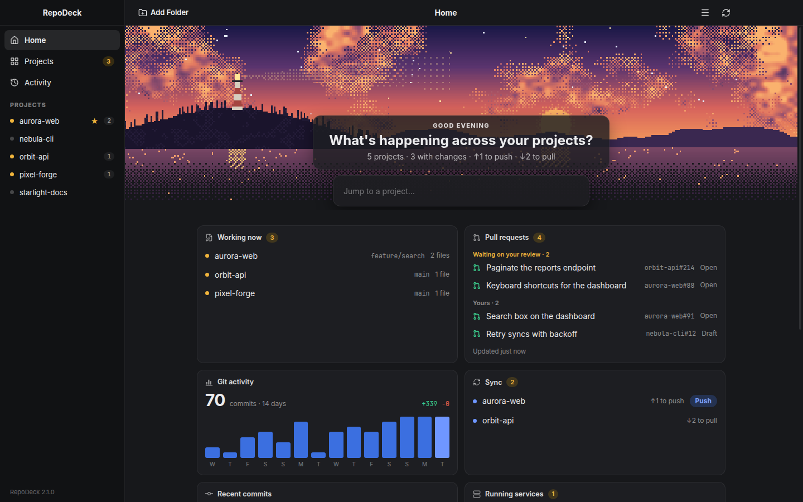
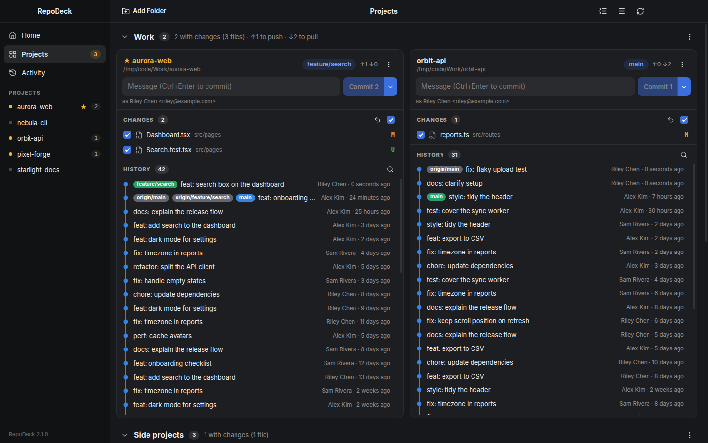
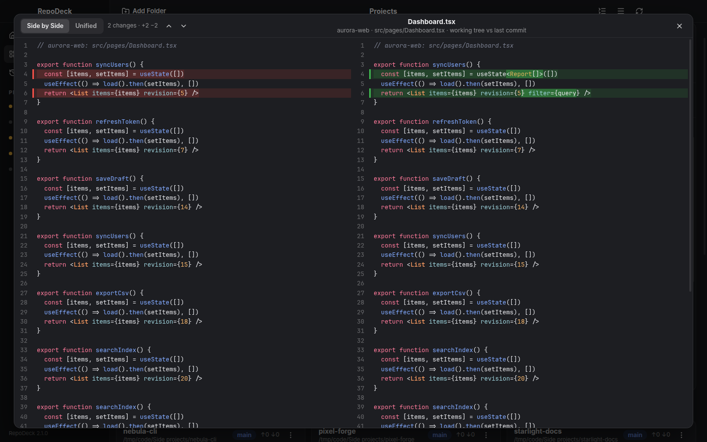
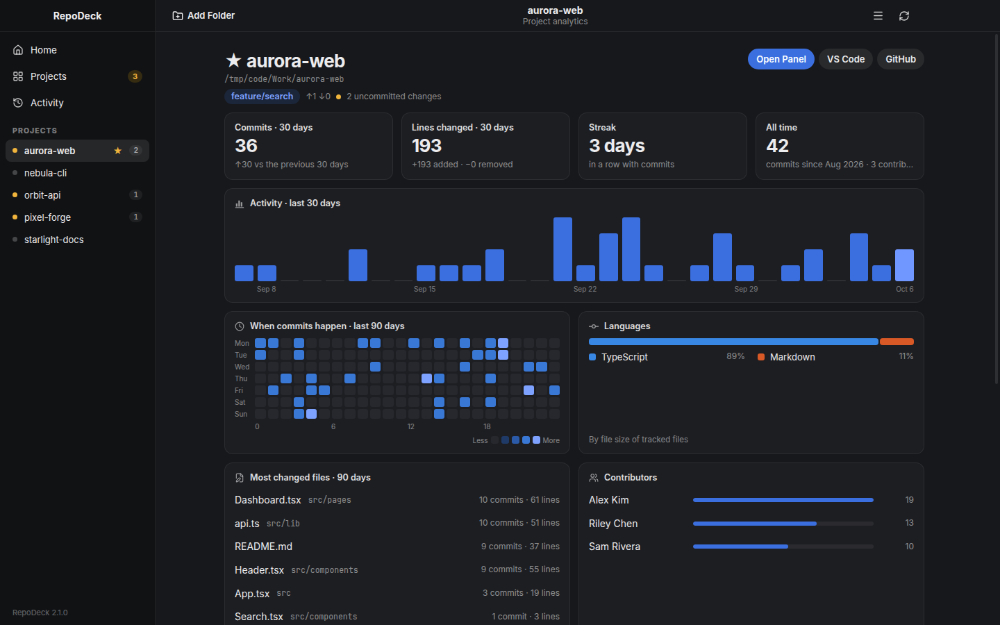

<p align="center">
  
</p>

<h1 align="center">RepoDeck</h1>

<p align="center">
  <strong>Source control for every repository you work on, side by side.</strong><br>
  Commit, stage hunks, switch branches and keep everything in sync, across all your projects, from one window.
</p>

<p align="center">
  <a href="https://github.com/UncleLYHME/repodeck/releases/latest"></a>
  <a href="https://github.com/UncleLYHME/repodeck/actions/workflows/ci.yml"></a>
  
</p>

<p align="center">
  <a href="https://github.com/UncleLYHME/repodeck/releases/latest"><b>Download</b></a> ·
  <a href="#features">Features</a> ·
  <a href="#install">Install</a> ·
  <a href="#development">Development</a>
</p>

<p align="center">
  
</p>

## Why RepoDeck

If you keep several editor windows open just to watch the Source Control panel of each project, RepoDeck puts all of them in one place. Point it at a folder of projects and every repository shows up as a panel with its changes, commit box, branches and history graph, plus a dashboard of what's happening across all of them. It watches the filesystem, so there is nothing to refresh.

## Features

### Every repository, one deck



- **Folders of projects become sections** that open and close; new projects (`git init`, `git clone`) appear by themselves and deleted ones disappear.
- **Commit exactly what you check.** Ctrl+Enter commits the checked files and leaves everything else, including other staged work, untouched. Ctrl+Shift+Enter commits and pushes.
- **Stage, unstage or discard hunk by hunk**, discard files (new files go to the Trash), and ignore a file, its extension or its folder from the right-click menu.
- **Branch pill**: switch branches, check out remote ones or create a new one by typing its name.
- **History graph** of all branches, remotes and tags. Click a commit to list its files with status letters, then click a file for its diff. Search by message, author, hash or file name.
- Stash and apply, abort a merge or rebase, open on GitHub or create a pull request, pin favourites to the top.

### See changes properly



Side by side or unified, with syntax highlighting, aligned lines, changed words highlighted and Alt+↑/↓ to jump between changes.

### Project analytics



Commits and lines over 30 days, streaks, when commits happen (weekday × hour), languages, the most changed files, contributors (with one person's different names and emails merged), branches, open pull requests and recent workflow runs.

### Always in sync, never surprising

- **Background fetch** every 5 minutes (configurable). It never prompts; anything that needs a password or a host-key check fails quietly and shows ⚠.
- **Auto-pull touches only the branch you're on**, and only fast-forwards. Uncommitted work is kept; if incoming commits change a file you're editing, it waits (**pull pending**) and retries once that file is committed or reverted. With unpushed commits *and* new remote ones it does nothing in the background (**syncs on push**).
- **Push** fetches first, then fast-forwards or replays your commits on top (`rebase --autostash`). On a conflict it puts everything back and tells you, so nothing half-done is left behind.
- Auto-pull can be switched off globally or per folder (for example, for work repositories).

### Home, Activity and the rest

- **Home**: what's uncommitted, what needs pushing or pulling (with a Push button), commits over the last two weeks, pull requests waiting on you, failing CI and dev servers running from your projects, under a pixel-art coast that follows the time of day.
- **Activity** logs what RepoDeck did on its own (pulls, fetch problems, new projects, CI failures) and every action you ran.
- **Notifications** when the window is in the background; **Start on Login**; a quiet, near-zero CPU footprint when idle.

## Install

Download the latest release for your platform from **[Releases](https://github.com/UncleLYHME/repodeck/releases/latest)**:

| Platform | File | Updates |
| --- | --- | --- |
| Linux | `RepoDeck-x.y.z.AppImage` (make it executable and run it) | Automatic |
| Linux (Debian, Ubuntu) | `repodeck_x.y.z_amd64.deb` | In-app prompt to download |
| macOS (Apple Silicon / Intel) | `RepoDeck-x.y.z-arm64.dmg` / `RepoDeck-x.y.z.dmg` | In-app prompt to download |
| Windows 10/11 | `RepoDeck-Setup-x.y.z.exe` | Automatic |

RepoDeck needs **git** on your PATH. Optional: the [GitHub CLI](https://cli.github.com) (`gh auth login`) for pull requests and CI on Home, and VS Code's `code` command for opening files.

> [!NOTE]
> The macOS app isn't signed with an Apple Developer ID yet. The first time, right-click RepoDeck in Applications and choose **Open** (or run `xattr -dr com.apple.quarantine /Applications/RepoDeck.app`). Windows may show a SmartScreen prompt for the same reason.

Then click **Add Folder** (Ctrl+O), or drag folders onto the window: a repository, or a folder that contains several.

### Updates

Installed copies check GitHub Releases every 30 minutes (switch off in Preferences). Windows and the AppImage download the new version in the background and show **RepoDeck x.y.z is ready → Restart Now**; the macOS app and the .deb show **Download**. You're asked first if a commit message is still unsent.

### Keyboard shortcuts

| Action | Shortcut |
| --- | --- |
| Add a repository or folder | Ctrl+O |
| Refresh everything (including GitHub) | F5 or Ctrl+R |
| Commit the checked files / commit and push | Ctrl+Enter / Ctrl+Shift+Enter |
| Next / previous change in a comparison | Alt+↓ / Alt+↑ |
| Context menu on a changed file | right-click, Shift+F10 or the Menu key |
| Preferences | Ctrl+, |

On macOS, use ⌘ instead of Ctrl.

## Your data

Settings and the folder list, a cache of git and GitHub results, and the activity log are stored locally:

| | Linux | macOS | Windows |
| --- | --- | --- | --- |
| Settings | `~/.config/repodeck` | `~/Library/Application Support/RepoDeck` | `%APPDATA%\RepoDeck` |
| Cache | `~/.cache/repodeck` | `…/RepoDeck/Cache` | `…\RepoDeck\Cache` |
| Activity log | `~/.local/state/repodeck` | `…/RepoDeck/State` | `…\RepoDeck\State` |

RepoDeck has no telemetry. It talks to the network only through your own `git fetch`/`pull`/`push`, the `gh` CLI (when installed) and the update check against GitHub Releases. It only ever touches repositories you've added.

## Development

Requires git, Node.js 22+ and pnpm.

```sh
pnpm install
pnpm dev          # the app with hot reload
pnpm test         # unit tests against real temporary git repositories
pnpm e2e          # Playwright drives the built app (Linux: under Xvfb)
pnpm typecheck
pnpm dist         # installers for the current platform, in release/
```

On Linux you can also run it straight from a checkout: `./install.sh` adds a `repodeck` command and an app-menu entry that start `bin/repodeck`. That launcher installs dependencies and rebuilds when the checkout changes (keeping the last good build if a build fails), and a checkout updates itself by fast-forwarding to new versions on its upstream branch.

### How it's built

| Part | What it does |
| --- | --- |
| `src/main` | Electron main process: the window, Trash, notifications, dialogs, links, login items and updates (electron-updater) |
| `src/core` | A utility process (plain Node): git through its CLI, file watching, background fetch and auto-pull, stats, GitHub through `gh`, the cache, the activity log and settings |
| `src/renderer` | React, Tailwind, Zustand, Base UI, CodeMirror's merge view and TanStack Virtual; talks to the core over a MessagePort through a small typed bridge (`src/preload`) |
| `src/shared` | Types, the commit-graph lane layout and the RPC protocol |

Git runs with `GIT_OPTIONAL_LOCKS=0` (no fighting your editor for `index.lock`), `GIT_TERMINAL_PROMPT=0` and literal pathspecs. Results derived from history are cached until the repository's refs move. The page runs with context isolation and no Node access, and loads nothing remote.

### Releasing

1. Raise `version` in `package.json` and add a `## x.y.z — date` section to [CHANGELOG.md](CHANGELOG.md).
2. Commit, then tag and push: `git tag vX.Y.Z && git push origin main vX.Y.Z`.
3. The [Release workflow](.github/workflows/release.yml) builds Linux, macOS and Windows installers, attaches them to a GitHub release with the changelog section as its notes, and publishes it. Installed copies pick it up within 30 minutes.

README screenshots come from a made-up deck: `pnpm build && xvfb-run -a node scripts/screenshots.mjs`.
